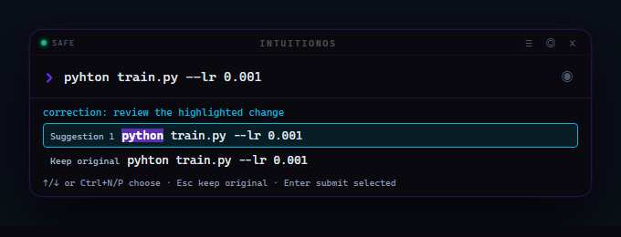

# IntuitionOS

> An intuition layer over your shell: it learns what you do next, says how sure it is, and can prove whether it was right.

**It is not an operating system.** It is a shell and a HUD that sit on top of one.
The name is aspirational; the thing it actually does is narrower and, hopefully,
more interesting.

IntuitionOS sits between traditional shells (exact, literal) and cloud AI
assistants (helpful, but remote). It records what you actually do, learns the
patterns, predicts what is coming next with a confidence number that has been
checked against reality, and lets a local model take real actions through a gate
that knows what each one costs if it turns out to be wrong. All of it runs on
your own hardware via Ollama, and none of it leaves the machine.

You reach it by typing, by speaking, or with your hands in front of a webcam.
What it can do for you spans reading and writing files, running commands,
arranging windows, reading a web page, setting reminders, and answering
questions — each one declared in a manifest with how bad it would be to get it
wrong, and gated on that.

**One idea runs through all of it:** how fast something must answer decides how
much authority it gets. A suggestion while you type has microseconds and may
change nothing. A model with tools has seconds and may only propose. In between
sits a learned predictor that says how sure it is, in numbers that have been
checked. Those tiers are separate on purpose, and the separation is the design.

The claims in this README are measured. See [Does it work?](#does-it-work).

For the code itself, start with the [architecture and component guide](docs/architecture.md),
then the [command-resolution API and protocol](docs/command-resolution.md) and
[contributor guide](docs/development.md). The [dated milestone report](docs/2026-09-07-command-resolution.md)
contains test feedback, evaluation results, and the HUD showcase.
The [HUD recovery report](docs/2026-09-07-hud-recovery.md) covers launcher,
connection, and microphone fixes with live verification.
The [branch consolidation report](docs/2026-09-07-main-consolidation.md) records
the merge into `main` and subsequent bug fixes. The original 2025 prototype is
preserved in the [historical archive](archive/README.md).

For optional BrainBit headset connection and the explicitly started, local EEG +
webcam experiment, see the [BrainBit guide](docs/brainbit.md). The experimental
preview is disarmed by default. Its experimental EEG-only left/right/rest model
requires separate training, held-out validation, and explicit desktop arming.

---

## Two interfaces

### HUD overlay (Electron)

A frameless, always-on-top ambient overlay that lives at the top of your screen. Press `Alt+Space` anywhere to summon or dismiss it. It expands when you interact and collapses to a minimal bar otherwise — an OS layer, not another app window.

- Dark glassmorphic panel — no window chrome, no taskbar entry
- Live memory and task panels (click ◎ and ≡ in the header)
- Cyan glow on `›` when the anticipator is running in the background
- Ghost hint shows what it thinks you are about to do, with its opacity tracking
  how confident it is — hover to see why
- Replies stream token by token as the model works
- A confirmation bar for anything the gate will not run on its own, styled
  differently for actions that cannot be undone
- Reminder toasts flash the HUD border when a scheduled task fires

### Terminal (classic)

A REPL with visible command correction, Rich-formatted output, and the same brain,
memory, predictor and gate as the HUD. Confirmations are answered at the prompt
instead of in a bar. The HUD additionally provides voice input, panels, and
direct Windows intention routing; both interfaces share the core action policy.

---

## Quick start

### HUD overlay

```powershell
# 1. Clone and set up Python environment
git clone https://github.com/soheilAppear/IntuitionOS
cd IntuitionOS
python -m venv .venv
.\.venv\Scripts\activate
pip install -r requirements.txt

# 2. Install Electron (one time)
cd ui
npm install
cd ..

# 3. Start Ollama (optional — file, window and task features work without it)
$env:OLLAMA_KEEP_ALIVE = "-1"    # see "Keeping the model warm" below
ollama serve

# 4. Pull whatever `model:` in config/config.yaml names. Check it first:
#      Select-String '^model:' config/config.yaml
#    The two must agree, or your first message returns an HTTP error.
ollama pull <the model named in config.yaml>

# 5. Launch
python start_ui.py
```

You do **not** need to activate the venv first. The launcher runs the backend
under `.venv` whichever interpreter started it, and says so when it switches.

### Choosing a model

Any Ollama model with tool support works. `config/config.yaml` decides which,
and the only hard rule is that the name there and the name you pulled must
match exactly, tag included.

Two properties matter more than raw size. The tool loop parses a JSON object out
of each reply, so a model that emits clean structured output beats a larger one
that does not — `core/llm.py` asks for `format="json"` with thinking disabled to
help. And a mixture-of-experts model generally answers faster than a dense model
of the same parameter count. `brain.budget_ms` defaults to 20 seconds and is
checked between calls; an in-flight model or tool call can take longer.

### Keeping the model warm

Ollama unloads an idle model from VRAM after `OLLAMA_KEEP_ALIVE` (5 minutes by
default). The next message then pays a cold start — tens of seconds on a large
model — which **exceeds the 20-second turn budget**, so the HUD looks broken
when it is only waiting for a reload.

| Setting | Effect |
|---|---|
| `OLLAMA_KEEP_ALIVE=-1` | Never unloads. Every turn is warm; VRAM stays occupied. |
| `OLLAMA_KEEP_ALIVE=5m` | Default. Frees VRAM, but the first message after a pause is slow. |
| `ollama stop <model>` | Manual release, for when you want the GPU back for something else. |

`ollama ps` shows what is currently resident.

Use `Alt+Space` to toggle the HUD. `Ctrl+Q` to quit.

**Keep the launcher terminal open.** `start_ui.py` waits for the backend's
`/health` response before opening Electron and supervises both processes.
Ctrl+C in the launcher or Ctrl+Q in the HUD stops the children it started;
Windows cleanup includes their child process trees. If the backend crashes,
the launcher closes its HUD and reports the backend error.

If port `7432` is already occupied by an IntuitionOS backend, launch just the
overlay with `cd ui` followed by `npm start`, keeping that backend's launcher
running. `npm start` alone does not start Python. The full launcher checks an
occupied port and explains whether an existing backend is healthy; it never
stops another process to free the port.

### HUD troubleshooting

| Symptom | What to do |
|---|---|
| `OFFLINE`, reconnecting, or Enter cannot submit | Run `.\.venv\Scripts\python.exe start_ui.py` from the project root and keep its terminal open. Read any startup error there. The HUD preserves the draft and requests a fresh review when it reconnects. |
| Enter shows a review instead of running the command | Wait for the current candidate to appear, then press Enter again. A newly edited command must be displayed before it can be submitted. |
| Port `7432` is occupied | Check `http://127.0.0.1:7432/health`. If an existing IntuitionOS backend is healthy, use the overlay-only command above. Otherwise identify the listener or check the backend's startup output before retrying. |
| Microphone is dimmed or preparing | Click or hover over it for the reason. Voice uses a separate Whisper model; first setup may download its files. Text commands remain usable while voice prepares. |
| No speech is detected or a microphone error appears | Select the intended default input in Windows sound settings, check its input meter and microphone permission for desktop apps, then retry. A virtual or streaming input may be selected instead of your physical microphone. Restart the launcher after changing devices if needed. |

Mic input uses the **Windows default input device**. Press Alt+V or click the
mic to record; stop with the same control or pause for silence detection.
Loading, device, and transcription failures now produce visible feedback and
clear the recording indicator. Transcription runs locally after the model is
available. Speech fills an editable draft—it is never submitted automatically.

See the [recovery report](docs/2026-09-07-hud-recovery.md) for the observed failure,
fixes, and live checks.

### Terminal

```powershell
python intuitionos.py
```

### Command correction: shared by the HUD and terminal

Type an imperfect command and review the proposed full command before submitting:

```text
gti status                       → git status
pyhton train.py --lr 0.001        → python train.py --lr 0.001
git statsu                       → git status
/taks                            → /tasks
```

The changed token is highlighted. **Ctrl+N / Ctrl+P** cycle suggestions and
**Keep original**; **Escape** selects the original; **Enter** submits the
displayed choice. If an edit has not been displayed yet, Enter requests a fresh
preview rather than submitting a replacement. The HUD also supports arrow keys
and clicking a candidate. Voice fills an editable draft and uses the same review
step. Editing revokes old correction selections and pending action approvals.

The shared core distinguishes exact commands, incomplete names, likely spelling
mistakes, ambiguous alternatives, and unsupported input. Adjacent transpositions
work immediately with no history or Ollama. Explicitly accepted corrections
influence later ranking through frequency, recency, and project context. These
are **ranking scores, not probabilities**; correction acceptance and execution
success are separate observations.

Only a command token, or a Git subcommand understood by its provider, is changed.
Argument text, spacing, quotes, flags, paths, and values are preserved. Valid
commands stay exact even when a more common alternative exists. Pipelines,
redirection, chaining, expansions, quoted executable names, and other syntax the
parser cannot safely span receive an explanation and no correction. Bare inputs
with unsupported shell syntax are not dispatched automatically; the existing
quoted `/exec "..."` route remains available for intentional shell expressions.

Available shell commands execute through the **irreversible `run_command`
capability**: Safe Mode must be off and the displayed action must be confirmed.
Spelling scores never grant permission. The existing quoted `/exec` form retains
its project-venv Python behavior; bare commands and unquoted `/exec` preserve the
selected command exactly in the configured execution shell.

The default execution shell is **CMD on Windows** and **`sh` on POSIX**, regardless
of the terminal used to launch Python. Executables/scripts are discovered from
the actual PATH and PATHEXT, alongside shell built-ins. Git obtains available
subcommands and aliases through a fixed metadata query. Discovery never invokes
a proposed candidate. Providers can be extended for additional namespaces.

To use PowerShell and capture the current session's aliases/functions, launch
from that session:

```powershell
.\scripts\start-intuition.ps1 -Interface terminal
# or:
.\scripts\start-intuition.ps1 -Interface hud
```

The launcher makes a temporary local snapshot and deletes it on exit. Execution
and discovery use the same PowerShell `-NoProfile` environment plus that snapshot.
For a clean PowerShell environment without a snapshot, set
`$env:INTUITION_SHELL = "pwsh"` (or `"powershell"`) before the normal launcher.
Snapshots preserve definitions, not closures, session variables, module state,
or later interactive changes. Each executed shell command uses a fresh child
process; changing directory there does not change the assistant's project.

See the [2026-09-07 milestone report](docs/2026-09-07-command-resolution.md) for
the measured comparisons, test feedback, supported shells, and remaining limits.



The image uses the actual Electron renderer with a fixed resolver response and
no backend connection; it does not depict a command being executed.

---

## What you can do

### File system (instant, no Ollama needed)

```
ls
tree
/read config/config.yaml
/read requirements.txt
```

### Create an empty file (no Ollama needed)

```text
make a new file 1.py in desktop directory
create a file "Meeting Notes.txt" in Documents
create an empty file scratch.py in the current directory
```

The HUD and terminal recognize these requests as file creation, so `make` is
not corrected to the Windows `makecab` command. Choose Desktop, Documents,
Downloads, or `CreatedFolder` inside the current project (the default). Windows uses the actual configured folder,
including a Desktop redirected to OneDrive. Existing files are never overwritten;
the reply shows the full path of the new empty file. `/undo` can remove it only
while it remains unchanged.

Generated text and Python code also go in `CreatedFolder`: ask for a file with
contents, or use `/write hello.py "print('Hello')"`. Read it with
`/read CreatedFolder/hello.py`. File writes are confined to this directory;
`CreatedFolder/` is ignored by Git, so generated output is excluded from pushes.

The model uses general computer tools to interpret other requests. It receives
the computer's current local clock and can open browser searches for live
information. Browser launching does not yet let it read page contents, so a
weather search can be opened but its conditions cannot be verified by that tool.

### Websites in the HUD (no Ollama needed)

```text
open chrome and go to google.com
go to google.com
open https://example.com in edge
```

The HUD opens the website directly in Chrome, Edge, Firefox, or your default
browser. These requests work with Safe Mode on. If the selected browser cannot
be found or launched, the HUD reports the problem. The reply confirms an open
request; it does not inspect the page or confirm that it finished loading.

### Memory

```
/save "working on HUD overlay feature"
/save "Ollama model: llama3"
/recall Ollama
/recall HUD
```

Click **◎** in the HUD header to browse the full memory panel.

### Habits it works out for itself

```
/dream
/rules
/rules delete 3
```

`/dream` reads back the episode log and looks for things you do repeatedly in the
same situation — what follows a particular command here, what you run in this
directory at this hour. Each recurring pattern is put to the local model, which
decides whether it is a genuine habit or an accident of a short log and names it
in a sentence. Rules are then consulted with no model in the query path at all,
because something that takes seconds to answer cannot sit inside a keystroke.

`/rules` is the payoff, and it is deliberately in plain language:

```
What I think I have noticed about how you work:

  #1  You run the test suite right after committing.
        seen 62x · hit rate 64% of 14 shown · predicts 'pytest -q'
  #2  You start the dev server after pulling.
        seen 20x · recently held 100% · not yet tested on you · predicts 'npm run dev'

Delete one you disagree with: /rules delete <id>
```

Those two lines report **two different numbers**, and the distinction is the
honest part. *Recently held* is how often the pattern actually held in your log,
weighted toward recent behaviour — it is what the rule was mined on. *Hit rate*
is how often you took the suggestion once it was genuinely put in front of you,
and it only exists after that has happened. A rule that has never been shown to
you says so rather than inventing a number for a test that has not been run.

Mining is recency-weighted on the same half-life as the predictor, so a workflow
you abandoned months ago cannot outvote the one you use today, and a belief the
current window no longer supports is retired on the next `/dream` — deactivated
rather than deleted, so `/rules --all` can still show what it used to think and
that it stopped. A rule whose measured hit rate decays is retired the same way.

A rule never silences the rest of the system. It competes with the learned
predictor and the stronger signal wins, which is what stops a freshly promoted
rule from lowering confidence in something already predicted well. Running
`/dream` should never make the system worse at a habit it had already learned.

Ollama being unavailable does not break any of this: patterns are still found and
promoted, with statistical descriptions instead of written ones, and the report
says so plainly.

### Natural language scheduling

```
remind me check the build in 10m
remind me push to GitHub in 1h
/tasks
/done 1
/snooze 2 15m
/delete 3
```

The HUD border flashes and a toast appears when a reminder fires.

### Scoped execution, with a journal and an undo

```
/safe off
/exec "python your_script.py"
/safe on
```

Safe Mode is **on by default**. The green dot in the HUD header turns red when it
is off. Click the dot or **SAFE ON / SAFE OFF** label to switch it directly;
the button updates when the backend acknowledges the change. Your draft stays
in place, and switching the mode does not approve any waiting action.
If a permission prompt is already open, turning Safe Mode off updates it to
ask only for approval to run the action.

If a HUD action needs Safe Mode off, it shows **Turn off Safe Mode and run?**
with the action details. **Yes, turn off & run** changes the mode and executes
that exact action; **No, cancel** leaves the mode unchanged and cancels the
action. Safe Mode stays off after approval until you turn it back on. Editing
the input or disconnecting cancels a waiting approval. The terminal continues
to use `/safe off` followed by its normal action confirmation.

**This is not a sandbox, and calling it one would be a lie.** `run_local` executes
with your full privileges. What it has instead is a gate and a record:

- Every action is declared in a **capability manifest** (`core/capabilities.py`)
  stating how bad it is to be wrong — `free`, `reversible`, or `irreversible` —
  whether a human must approve it, and where in the filesystem it may look.
- Paths are **resolved and jailed** by path component, not by string prefix.
- Anything `irreversible` requires explicit confirmation, at any confidence.
  Safe Mode also blocks it, except the narrowly scoped hand-control close flow
  described below: pinch selects one window and a separate thumbs-up approves
  its normal close request. This exception does not turn Safe Mode off.
- Every action that changes something is written to an **audit journal**
  (`/journal`), and reversible ones can be taken back with `/undo`.

Run `/capabilities` to see the whole surface with each entry's declared cost.

#### Who is asking matters as much as what is asked

The gate's second axis is the **actor**. The same capability is judged differently
depending on what drove it, because "you typed this" and "a camera thought it saw
this" are not the same claim. Five actors exist, and each is restricted by how
deliberate its input is:

| Actor | What it is | May reach |
|---|---|---|
| `user` | You typed or said it | everything, subject to Safe Mode and confirmation |
| `model` | The LLM proposed it in its tool loop | reversible freely; irreversible parks for your approval |
| `scheduler` | A reminder fired unattended | nothing irreversible — nobody is present to answer |
| `anticipator` | A guess about what you might do next | `free` only. It is speculating; it may not change anything |
| `gesture` | A camera's reading of your hand | reversible actions; closing one captured window requires a separate confirming gesture. Other irreversible actions are refused |

An isolated gesture can move a window; closing requires the deliberate sequence
in [Hand controls](#hand-controls), with a short-lived approval for that exact
window. Shutdown, process termination, and deletion remain unavailable to the
camera. The actor distinction also draws a line the plain
`requires_confirmation` flag could not: opening a browser window is a *request*
when you ask for it and a *surprise* when the model decides on its own, so
`os_open_url` asks the model to confirm and lets you through directly.

#### The loop will not repeat itself

Within one turn, the model cannot dispatch the same capability with the same
arguments twice. The repeat is answered with the first result and a note that
retrying will not change anything.

`brain.max_iters` counts model/planning steps, including invalid or repeated
proposals, not just executed tools. Repeated requests without progress trigger
an answer-only recovery; reaching the step limit also reserves one answer-only
model call if time remains. That recovery cannot run more tools. If the model
still cannot answer, or the time budget expires, the reply includes the actual
tool results or errors instead of discarding them behind a limit message.
Waiting for human confirmation pauses the work budget; confirmed and declined
requests are remembered so the model cannot execute or ask for them again in
that turn. Confirmation-token expiry still applies.

That bound exists because the failure it prevents is not hypothetical. Asked "how
is the weather", the model called `os_open_url`, got back a confirmation that a
page had been *opened* — which is not the weather, because opening a page cannot
return its contents — and tried again, once per iteration, until `max_iters`
stopped it. Five tabs, for one question. Tools whose result cannot satisfy the
request are exactly the ones with side effects worth not repeating.

### AI (requires Ollama)

```
what does the anticipator do?
explain the memory system
write a python function that reads a csv file
what are we building?
```

Saved notes reach the model two ways. You can ask for them with `/recall`, and
they also **surface on their own** when the situation matches — the branch you are
on, the file you just wrote, the command you just ran. A note about the release
branch appears when you switch to it, without you remembering it exists.

Retrieval is FTS5 with BM25 ranking plus a recency weighting, bounded by a token
budget so a large note database cannot crowd the model's instructions out of the
prompt.

### Reading a web page

Asking about something on the web makes the model read the page rather than
just putting it on your screen:

```
what does the top story on news.ycombinator.com say?
how is the weather in Toronto?
```

Two separate capabilities, because they do different things and the difference
used to be the source of a real bug:

| | What it does | Who may run it |
|---|---|---|
| `os_fetch_url` | Fetches a page and returns its **text** to the model | model or you, no confirmation |
| `os_open_url` | **Shows** the page in a browser, returns nothing readable | you directly; the model must ask first |

Opening a page can never hand its contents back, so a model asked a question it
could only answer by reading would open the page, still not know the answer, and
try again — one browser tab per iteration until the loop's limit stopped it.
Giving it a tool that actually reads is the fix; the tool descriptions say which
is which, and the loop now refuses to repeat an identical call.

`os_fetch_url` is the only part of IntuitionOS that makes an outbound request,
so it is deliberately fenced:

- **Never speculative.** It is not a `free` capability, and `free` is precisely
  what the anticipator is allowed to run on a guess. IntuitionOS will not fetch
  a URL because it thought you might ask.
- **Public web only.** The host is resolved first and refused if it lands on
  loopback, a private range, link-local, or anything else inside your network —
  so the model cannot read Ollama's API on `11434`, this backend on `7432`, your
  router, or a cloud metadata endpoint. A public-looking name that resolves home
  is refused on the address, not the spelling.
- **Bounded.** HTTP(S) only, a request timeout, a response size ceiling, and
  scripts and stylesheets stripped before any text reaches the model.

Redirects are limited and every destination is checked before fetching it.
DNS resolution and connection remain separate, so this does not eliminate
DNS-rebinding races. Binary responses are refused; invalid charset labels fall
back to UTF-8, and incomplete excerpts are marked as truncated. Every fetch is
journalled like any other non-free action.

Weather lookups request conditions in words and preserve the returned units.
For example, wttr.in's [`%C` format](https://github.com/chubin/wttr.in#one-line-output)
returns a textual condition; an emoji-only response is not a reliable basis for
the local model to describe sunshine, clouds, or rain.

### Hand controls

Choose **Hand Mouse** or **Desktop gestures** in the visible mode bar while the
camera is off. The supplied configuration selects **Hand Mouse**. Click
**CAMERA OFF** in the HUD header to start hand tracking. The button shows
**STARTING…** until recognition is ready, then **CAMERA ON**. Click it again to
stop tracking and release the webcam. Camera errors appear below the input, and
when a gesture triggers an action, its result appears there. The button also
stays in sync when you use these commands:

```
/gestures on
/gestures status
/gestures off
```

A webcam tracks one hand. Tracking stays off until you enable it. Open **Hand
controls** below the input for the gesture guide, live movement meter, desktop
mode, model choice, sensitivity settings, and optional **Show camera preview**.
The preview shows the mirrored camera image, a 21-point hand skeleton, the
recognized pose, the current movement hint, and capture FPS. It uses the same
camera frames as recognition; opening the preview does not start tracking or
open a second camera. Frames stay local in memory and are not recorded to disk.
The preview endpoint accepts the local desktop client and rejects requests from
web pages, even when the rest of the local API permits cross-origin requests.

#### Hand Mouse

In **Hand Mouse**, extend your index finger and curl the other three fingers.
Hold that pose briefly (about 0.2 seconds), then move your hand to move the pointer
on the primary screen. Tracking uses a stable point near the finger base, so small
fingertip bends keep control active and do not pull the click target away.
Once active, relax your fingers to move; fully opening all four fingers enters
navigation. Brief tracking loss freezes the pointer for up to 150 ms, and recovery
does not click. A longer interruption requires pointing again.
Smoothing is stronger during small, shaky movements and responds faster during
deliberate travel. Use **Show camera preview** to check the current pointer hint.
The central camera area maps to the screen.

| Hand Mouse gesture | Action |
|---|---|
| Point with index finger | Move the pointer |
| Raise index, middle, ring and pinky; hold still for 0.3 seconds, then move | Navigate desktops sideways, Task View upward, or Show desktop downward; hold briefly at 100% to finish automatically |
| With optional index bend click enabled, keep thumb apart and curl the end of the index while keeping its knuckle raised | Hold about 0.12 seconds for one left click; straighten about 0.15 seconds before another |
| After pointing, pinch thumb and index briefly, then separate them | Left click at the pointer |
| Hold that pinch until the hint says **Dragging**, then move your hand | Drag; separate thumb and index to release |
| Make a full fist, lower your hand, or turn the camera off | Pause movement and release any held mouse button |

Point again to resume. A bend or pinch already held when tracking starts cannot
click; point first. **Index bend click is off by default**; enable its checkbox
in Hand controls with the camera off and press **Apply**. Holding a bent finger
does not repeat clicks. Keep your thumb apart for bend clicks: bringing thumb
and index together selects pinch/drag instead. Opening a fist into a point does
not click. Releasing an active drag
can complete a drop in the target application; pausing does not undo a drop.

Each completed bend or pinch click gets a soft local tick and a brief **Clicked**
badge. Use **Sound on/off** in the mode bar to mute it while keeping tracking on.
The sound plays independently of the HUD being focused or visible and never
blocks pointer processing. It plays after successful mouse input, not merely a
recognized pose; failed clicks and drag releases do not generate a click tick.
Set `gestures.click_sound` in `config/config.yaml` to keep the preference across
backend restarts. Sound errors are shown by the sound button and do not stop
mouse control.

This mode is deliberate, direct mouse input: clicks act on whatever is under the
pointer, like a physical mouse, including while automation Safe Mode is on.
The model and planner cannot invoke this input controller. Existing automated
mouse capabilities retain their capability checks. Four raised fingers pause
the pointer and activate navigation; your thumb can rest comfortably apart from
the index. Point again to resume the mouse. Window poses remain inactive in Hand
Mouse, so pointing does not restore a window and pinching does not request closing
one. Change modes with the camera off.

#### Desktop gestures

Select **Desktop gestures** before enabling the camera. For desktop switching,
first create a second Windows desktop if needed:
press **Win+Ctrl+D once**. In Windows **Settings → Bluetooth & devices →
Touchpad → Four-finger gestures**, set horizontal swipes to switch desktops.
If your Windows touchpad settings differ or that setting is unavailable, select
**Measured steps** in the HUD instead.

Keep your hand facing the webcam and hold an open palm still for about
**0.3 seconds**, until the meter says ready. Then move it along one axis. After
activation, three raised fingers are enough to continue. A 0.25-palm dead zone
filters small movements and the first clear movement locks the axis.
Movement is measured relative to palm length (wrist to middle knuckle), so
slow, deliberate swipes count too. The default full movement is **1.2 palm
lengths**. The meter shows hand travel, not the exact percentage of the Windows
desktop animation.

| Gesture | Action |
|---|---|
| Hold an open palm, then move left | Reveal the next desktop, to the right of the current one |
| Hold an open palm, then move right | Reveal the previous desktop, to the left of the current one |
| Hold an open palm, then move up to 100% and hold briefly | Toggle Task View with windows and desktops |
| Hold an open palm, then move down to 100% and hold briefly | Show/hide the desktop |
| Hold up one index finger for 0.65 seconds | Restore the active window to its normal size |
| Hold up index and middle fingers for 0.65 seconds | Switch to the next window |
| Touch thumb and index finger together; hold the pinch for 1 second | Request closing the active window; the HUD shows its title |
| After a close request, hold a thumbs-up for 0.65 seconds within 6 seconds | Confirm closing that selected window |
| Make a fist or lower the hand while a close request is pending | Cancel the close request |

For navigation, **reach 100% and hold for 0.1 seconds to finish automatically**.
No fist is required. A small tremor down to 90% is tolerated during that short
hold; reversing below 90% resets it. A fist or pinch before completion cancels.
Brief tracking loss or uncertainty freezes progress for up to 150 ms; a longer
loss or distant reappearance cancels. Lower the hand or make a fist for 0.2 seconds
before another swipe; point again for the pointer. Holding the same pose does not repeat an action, and a
pinch used to cancel cannot turn into a click or close request. The HUD shows
completion or cancellation and when to reset your hand.
In Desktop gestures, that reset is also required before a new window-control
pose: keeping a point, two fingers, thumbs-up, or pinch held cannot fall through
from navigation into a window action.

**Smooth when supported** follows sideways hand movement using Windows' native
four-contact touchpad input, smoothed at 60 Hz with follow-through and release.
Windows controls the animation, final snap, and the assigned horizontal gesture.
If native input is unavailable, **Measured steps** sends one desktop shortcut
after completion, with no continuous desktop movement. A failure during a native
swipe stops that swipe; it does not also send a desktop shortcut.

Up/down always uses **Win+Tab** for Task View or **Win+D** for Show desktop after
completion, in either desktop movement setting. These shortcuts toggle their
views and do not animate progressively with the hand. In Hand Mouse, begin with
four raised fingers; in Desktop gestures, begin with an open palm.
To choose from all desktops in **Hand Mouse**, swipe up to open Task View, lower
your hand briefly, point to resume the pointer, then pinch and release on the
desktop thumbnail you want.
Microsoft documents the [synthetic touchpad API](https://learn.microsoft.com/en-us/windows/win32/api/winuser/nf-winuser-createsyntheticpointerdevice2)
and [four-finger gesture settings](https://support.microsoft.com/en-US/Windows/Hardware/input-devices/touch-gestures-for-windows).
Controlled Windows input checks switched to the expected adjacent desktop and
restored it, displayed Task View, and showed/restored the desktop. These checks
do not measure webcam gesture accuracy or perceived smoothness. The
[navigation validation guide](docs/hand-navigation-validation.md) records the
evidence, automated coverage, and remaining live hand test sequence.

The HUD automatically stays visible on **every virtual desktop**, including
when the camera is off. It remains the same window, with the same command draft
and hand feedback; switching desktops does not reopen or refocus it. **Alt+Space**
and the hide button hide that window everywhere.

On Windows, a small isolated helper pins the exact HUD window through the shell
and verifies the result. The HUD rechecks periodically so it can recover after
Explorer restarts. Electron's [all-workspaces API has no effect on Windows](https://www.electronjs.org/docs/latest/api/browser-window#winsetvisibleonallworkspacesvisible-options),
and the shell pin interfaces are not a public compatibility guarantee. If a
Windows update prevents automatic pinning, the HUD displays a **Retry** notice;
the manual fallback is **Win+Tab → right-click IntuitionOS → Show this window on
all desktops**. Pinning applies only to this HUD, not other Electron applications.

Turn the camera **off** before changing **Desktop movement**, **Hand travel**,
or the hand model, then press **Apply**. Hand travel ranges from **0.8 to 3.0
palms**; smaller values need less motion. The supplied configuration selects
**WiLoR + AnyHand · GPU**. **MediaPipe Full**, **MediaPipe Lite**, and **RTMPose Hand5** remain available
for comparison or machines without the optional GPU runtime. The same gesture
and confirmation rules apply to each tracker.
HUD adjustments last until the backend restarts. To keep preferences across
restarts, edit `gestures.desktop_mode`, `gestures.travel_palms`, `gestures.tracker_backend`, and
`gestures.model_complexity` in `config/config.yaml`, then restart the backend.

#### Optional Windows GPU hand tracker

Install once on a new machine:

```powershell
.\.venv\Scripts\python.exe setup_wilor.py
```

This installs the **full 32-layer WiLoR transformer with AnyHand fine-tuned weights**
from the [AnyHand project](https://github.com/chen-si-cs/AnyHand), together with its
hand detector. It reconstructs 21 hand joints in 3D and projects them into the
camera image for the existing controls. An NVIDIA GPU and CUDA-compatible driver
are required; the installer uses CUDA 13.0 PyTorch, including RTX 5090 support.
The runtime is isolated in `data/wilor-env`, with about 2.6 GB of model assets in
`data/wilor-models`, verified against pinned SHA-256 checksums. Initial GPU loading
takes several seconds; the HUD displays Starting until capture is ready.

The published WiLoR/AnyHand weights and MANO assets carry noncommercial/research
restrictions. They remain local and are not bundled in the repository. See
[WiLoR's license declaration](https://github.com/rolpotamias/WiLoR#license) and
[MANO's terms](https://mano.is.tue.mpg.de/license.html) before redistribution or
commercial deployment.

Select **WiLoR + AnyHand · GPU** in **Hand controls → Hand model**, press **Apply**,
then turn on the camera. The preview reports the selected model. Installation
and opening the guide never activate the camera. Inference stays local, with
one frame in memory at a time; the worker performs no network requests. Turning
the camera off releases the GPU worker, and Windows also terminates it if its
owning backend exits. If cleanup fails, **Retry cleanup** retries release before
another model can start. Startup errors are visible rather than silently using
a CPU or a different model; details are in `data/hand-tracker.log`.

WiLoR has stronger published 3D hand-pose and occlusion results than the previous
lightweight trackers, but results depend on the task. Our small reference-image
comparison retained more hands than RTMPose; MediaPipe still placed visible 2D
joints more accurately in that test. See [model evaluation notes](docs/hand-tracking.md).
The app still uses its existing gesture rules. Missing detections, implausible
skeletons and results older than 250 ms pause control. Compare the live skeleton
using your failing movements before judging your own webcam accuracy.
To use MediaPipe instead, choose it while the camera is off; persistent config
is `tracker_backend: mediapipe`, with `model_complexity: 1` for Full or `0` for Lite.
The earlier RTMPose alternative uses `setup_hand_tracking.py` and
`tracker_backend: rtmpose`; it runs through Windows DirectML in `data/tracking-env`.

In Desktop gestures, window actions still pass through the capability gate. Closing is the sole
exception to the ban on irreversible camera actions: the pinch captures an exact
window and process, and a separate thumbs-up consumes its expiring approval.
The app receives a normal close request and keeps its own unsaved-work prompts;
IntuitionOS does not force-kill the app, answer save dialogs, or disable Safe
Mode. Closing cannot be undone with `/undo`. Shutdown, process termination,
file deletion, and other irreversible capabilities remain denied to gestures.
Camera loss, cancellation, and stopping tracking release synthetic contacts and
cancel any pending close approval.

Requires a webcam and the dependencies for the selected tracker. MediaPipe and
OpenCV are in `requirements.txt`; GPU trackers use their optional setup scripts. Missing
dependencies or a missing camera are reported by `/gestures status`; the backend
still starts normally.

### Hardware

```
/hw
/hw schema led_strip
```

Drivers are simulated by default. See `config/config.yaml` to configure real hardware.

---

## What is recorded on your machine

IntuitionOS keeps an **episode log**: one row for every input you submit, stored
in `data/intuition.db` on your own disk. Episode rows use an argument-free command
representation and a snapshot of the situation (working directory, git branch and dirtiness, hour
of day, how long you paused before pressing Enter, the last few commands), and —
when the HUD showed you a hint — whether you took it or ignored it.

This is deliberate and it is the point. A system cannot learn that you run
`pytest` after `git commit` unless something records *after what*. The rows the
predictor learns most from are the ones where it was **wrong**: a hint shown and
ignored is the negative signal that keeps its confidence honest.

Two things are worth being explicit about:

- **Nothing leaves this machine.** There is no telemetry, no upload, and no
  hosted API in the path. The log is a table in a local SQLite file. The one
  thing that does reach the network is a page you asked about — see
  [Reading a web page](#reading-a-web-page) — and it sends the URL, not your log.
- **It records without being asked.** Unlike `/save`, you do not opt in per entry.

So it comes with an off switch and an eraser:

| | |
|---|---|
| See what has been recorded | `/episodes` |
| Erase episodes and derived prediction/correction learning | `/forget` |
| Stop episode/correction learning | set `episodes.enabled: false` in `config/config.yaml` |

The action journal (`/journal`) is separate: it records attempted non-free
actions, including denied, declined, and failed actions. Successful undoable
actions also retain the data needed by `/undo`.

Correction events share the same SQLite database. They retain the original
command token, candidate tokens, explicit selection or manual edit, project key,
and execution outcome. Full argument values stay out of correction learning and
episode/context command representations. Ignored suggestions are not labelled
as rejected. `episodes.enabled: false` disables correction storage and ranking
from past acceptance, and `/forget` clears both stored evidence and live views.
Explicit notes, conversations, and the action journal remain separate stores;
the journal still records the actual arguments needed for auditing and undo.

---

## Does it work?

Claiming a system learns is easy. `eval/` exists so the claim can be checked, and
so it can fail.

```bash
python -m eval.run                        # synthetic log, baseline vs learned
python -m eval.run --db data/intuition.db # your own recorded history
python -m eval.run --json                 # machine-readable
```

The baseline column is the **original four-branch if-chain** — literally what this
project did before it learned anything — replayed over the same log. That is the
number that says whether the learned predictor was worth building.

Measured on the synthetic log: 800 episodes with habits planted in them at 25%
noise, split 70/30 **chronologically** (a random split would let the model learn
from your future and flatter every number). The predictor is scored on each
episode *before* being updated with it.

| Metric | Baseline (if-chain) | Learned | Calibrated |
|---|---|---|---|
| Top-1 accuracy | 12.5% | **55.0%** | 55.0% |
| Top-3 accuracy | 12.5% | **61.7%** | 61.7% |
| Prewarm hit rate | 12.5% | **64.9%** | 61.7% |
| Wasted prewarm rate | 87.5% | **35.1%** | 38.3% |
| False reveal rate (hints shown and ignored) | 0.0% | 9.5% | 9.9% |
| Expected calibration error | 0.050 | 0.057 | **0.037** |
| Hints shown (of 240) | 16 | 95 | 111 |

Tool-loop success: **100%** — 12 of 12 scripted model plans behaved as intended,
including the awkward ones. Those plans cover what a local model actually emits:
markdown fences, preamble before the JSON, trailing commas, prose with no JSON at
all, a hallucinated tool name, a path outside the jail, an irreversible action,
and a loop that never stops. The irreversible plan counts as a success by being
**parked for confirmation**, not by running.

Honest caveats, because the point of measuring is to stop guessing:

- **This is a synthetic log, not a user study.** It says the predictor finds
  patterns that are genuinely there and that the baseline cannot. It does not say
  how much it will help you. Run `--db data/intuition.db` after a few weeks for
  a number about your own habits.
- **Latency saved is estimated, not measured.** The replay does not execute the
  prewarmed actions, so the harness prints a flat figure and says so.
- **The false reveal rate went up, not down.** The baseline almost never showed a
  hint, and showing nothing is never wrong. Read that row next to "hints shown":
  the learned predictor offers roughly six times as many hints and is wrong about
  one in ten of them.
- **Calibration trades accuracy for honesty.** It leaves top-1 unchanged and cuts
  expected calibration error by about a third, which is the point — the number
  attached to a hint should mean what it says.

CI runs this on every push and fails the build if the learned predictor stops
beating the baseline by a clear margin, or if any tool-loop failure mode stops
being handled.

---

## Anticipation

Type `tree`, `ls`, or `read file <path>` **slowly**. Watch the `›` glow cyan — the
anticipator has already computed the result in the background. Press Enter and see
`⚡ cached` in the response. No waiting.

The ghost hint and the cached result are two different things and they are looked
up differently. The cached result is matched against the command you actually
submitted — exactly this command, already computed. The hint is matched against
what you have typed *so far*, so once the predictor has learned a habit, typing
`p` is enough to be offered `pytest -q`. A suggestion that only arrived after you
had finished typing the command would not be a suggestion.

What gets prewarmed is whatever the predictor has learned you tend to do, not a
fixed list. Two separate thresholds govern it, and the gap between them is the
design:

| Threshold | Default | What being wrong costs |
|---|---|---|
| `free` | 0.30 | A few milliseconds of a background thread |
| `reveal` | 0.70 | Your attention, to notice and dismiss a bad suggestion |
| `auto_execute` | 0.95 | A reversible change you did not ask for |
| `irreversible` | *never* | Everything |

The ghost hint's opacity tracks the calibrated probability, so a hunch and a
near-certainty do not look identical. Hover it to see why it was offered.

Speculative work runs as the `anticipator` actor, which the gate restricts to
`free` capabilities — it is guessing at something you have not submitted and may
never submit, so it is not allowed to change anything at all.

---

## Commands reference

| Command | Description |
|---------|-------------|
| `ls` | List directory |
| `tree` | Recursive directory view |
| `/read <path>` | Read a file |
| `/write <path> "text"` | Write a file inside CreatedFolder |
| `/save "text"` | Save a memory note |
| `/recall "term"` | Search memory |
| `/memory` | Show recent memory |
| `/dream` | Consolidate the episode log into rules |
| `/rules` | What the system believes about your habits |
| `/rules delete <id>` | Delete a belief and its influence |
| `/episodes` | What the episode log has recorded |
| `/forget` | Erase the episode log |
| `/journal [n]` | Recent gated actions |
| `/undo` | Reverse the last reversible action |
| `/capabilities` | Every action with its declared cost |
| `/calibration` | Is the stated confidence actually true? |
| `/thresholds` | The cost-gated confidence thresholds |
| `/tasks` | List open tasks (pending or already fired) |
| `/done <id>` | Mark task complete |
| `/delete <id>` | Delete a task |
| `/snooze <id> 15m\|2h\|1d` | Snooze a task |
| `/safe on\|off` | Toggle Safe Mode |
| `/exec "python script.py"` | Run a command, scoped to the project and journalled |
| `/gestures on\|off\|status` | Hand gestures through the webcam |
| `/hw` | List hardware devices |
| `/hw schema <name>` | Show device schema |
| `/actions` | List all registered actions |
| `/config` | Print current config |
| `/reload` | Reload supported settings; HUD model/database/voice/hardware changes require restart |
| `/help` | Show help |
| `/exit` | Quit terminal mode |
| `remind me <title> in/at <when>` | Natural language scheduling |

Visible correction covers `/` commands and available shell commands: `/hlp`
offers `/help`, `/taks` offers `/tasks`, and `gti status` offers `git status`.
The selected replacement is always shown before it can be submitted.

### Said in plain language

Some requests are recognised directly and routed to a capability without waking
the model, which is why they work with Ollama stopped. They still pass the gate.

```
open github.com                      →  os_open_url
make a file called notes.txt on my desktop
                                     →  create_empty_file
snap this window to the left         →  os_snap_window
what does example.com say?           →  os_fetch_url   (needs the model to read it)
```

### Moving windows

Available to you, to the model, and to gestures. All of it is reversible, and
`/undo` after a move restores the exact previous geometry because the journal
captured it first.

| Capability | Does |
|---|---|
| `os_list_windows` | Every visible window by title |
| `os_window_geometry` | Where a window is right now |
| `os_move_window` | Move and optionally resize |
| `os_snap_window` | Snap to a half, a quarter, or full screen |
| `os_window_state` | Minimise, maximise, restore |
| `os_focus_window` | Bring to the front |
| `os_cycle_window` | Next or previous window |
| `os_media_key` | Play/pause, track, mute, volume |

Titles match on a case-insensitive substring. An ambiguous title is an error
rather than a guess — moving the wrong window is worse than being asked again.
Omit the title entirely to mean the active window.

---

## Configuration

Edit `config/config.yaml`:

```yaml
backend: ollama
model: gpt-oss:20b         # must match what you pulled with `ollama pull`
temperature: 0.2
max_tokens: 600
timezone: America/New_York # reminders are parsed in this zone, stored as UTC
memory_db_path: data/intuition.db

brain:                     # planning limits; bounded answer-only recovery may follow
  max_iters: 8
  budget_ms: 20000
  history_turns: 6

thresholds:                # keyed on what being wrong costs
  free:          0.30      # prewarm
  reveal:        0.70      # show a hint
  auto_execute:  0.95      # act unasked; reversible capabilities only
  irreversible:  null      # never, at any confidence

prediction:
  half_life_s: 604800      # one week
  min_episodes: 50         # below this, the original heuristics are used

episodes:
  enabled: true            # set false to stop recording what you type

retrieval:
  k: 4                     # notes injected per turn
  budget_tokens: 700

consolidation:             # /dream
  window: 2000
  min_support: 4
  min_confidence: 0.5

anticipation:
  enabled: true
  debounce_ms: 180

hardware:
  drivers:
    - name: led_strip
      simulate: true
    - name: gpu_nvml
      enabled: true
```

`irreversible: null` is enforced rather than merely defaulted — putting a number
there would mean some confidence buys an action that cannot be taken back, and
the loader resets it. `reveal` is likewise clamped so it can never fall below
`free`.

Gestures are configured too, and are off until `/gestures on`:

```yaml
gestures:
  input_mode: mouse  # mouse = index-finger pointer; desktop = window/desktop gestures
  bend_click: false  # optional index bend clicks; pinch is the default click gesture
  click_sound: true  # soft tick for completed bend/pinch clicks; HUD can mute live
  camera_index: 0     # first webcam; raise this if you have several
  desktop_mode: auto # auto = smooth when supported; shortcut = measured steps
  travel_palms: 1.2  # 0.8–3.0; smaller values need less hand travel
  tracker_backend: wilor # NVIDIA GPU; alternatives: mediapipe, rtmpose
  model_complexity: 1 # MediaPipe only: 1 = full; 0 = light
```

Gesture timing is measured in seconds, as shown in the hand-control guide.
Legacy `hold_frames` and `cooldown_s` settings do not control these timed poses.
HUD sensitivity, mode and model changes are session settings; edit the YAML and restart
to retain your chosen defaults.

Environment variables (`.env` or shell):

| Variable | Effect |
|---|---|
| `OLLAMA_HOST` | Where the model lives. Default `http://127.0.0.1:11434` |
| `OLLAMA_KEEP_ALIVE` | Ollama's own setting. `-1` keeps the model resident; see [Keeping the model warm](#keeping-the-model-warm) |
| `INTUITION_SAFE` | `1` forces Safe Mode on at startup, then held in process memory |
| `INTUITION_SHELL` | `pwsh` or `powershell` to execute in a clean PowerShell instead of CMD |
| `INTUITION_ALLOW_SYSTEM_PY` | `1` uses the active interpreter instead of `.venv`, for both `/exec` and the launcher |
| `OLLAMA_NO_CLOUD` | Ollama's own setting. `1` stops its background account checks |

---

## Architecture

```
start_ui.py
  ├── uvicorn → interface/server.py      (FastAPI + WebSocket)
  │
  │   ── the safety substrate ────────────────────────────────────
  │     core/capabilities.py   manifest + the one gate all dispatch passes
  │     core/journal.py        audit trail and undo
  │     core/actions.py        the actions themselves (file, exec, task, hw)
  │     core/os_sandbox.py     OS surface (windows, volume, apps, web, power)
  │     core/user_files.py     named user folders, via the Known Folder API
  │
  │   ── understanding what was asked ────────────────────────────
  │     core/command_resolver.py  the shared correction core
  │     core/shell_environment.py PATH/PATHEXT discovery, shell providers
  │     core/os_intents.py        plain speech → an OS capability
  │     core/file_intents.py      plain speech → a file capability
  │
  │   ── learning from experience ────────────────────────────────
  │     core/context.py        cheap portable snapshot of the situation
  │     core/episodes.py       one row per submitted input, involuntarily
  │     core/predictor.py      frequency + recency, then feature scoring
  │     core/calibration.py    reliability curve, isotonic recalibration
  │     core/consolidation.py  offline: patterns become inspectable rules
  │     core/anticipator.py    speculative prewarming, bounded and TTL'd
  │
  │   ── senses ─────────────────────────────────────────────────
  │     core/voice.py          local Whisper, VAD, never auto-submits
  │     core/gestures.py       webcam → landmarks → pose, pure classifier
  │
  │   ── the slow path ───────────────────────────────────────────
  │     core/brain.py          propose → gate → execute → observe loop
  │     core/llm.py            Ollama client, streaming, typed errors
  │     core/retrieval.py      FTS5 + recency, cue-driven
  │     core/memory.py         SQLite store, one lock, several threads
  │     core/scheduler.py      reminders, timezone-correct, gated payloads
  │
  └── Electron → ui/
                  ├── main.js            (frameless window, shortcuts)
                  └── renderer/          (HUD interface)

intuitionos.py → interface/terminal.py   (classic REPL, same core)
eval/                                    (replayable metrics, CI gate)
plugins/                                 (hardware drivers, simulated by default)
```

**Workers that run on their own clock.** Five subsystems own a thread and keep
their own rhythm rather than being stepped by a central loop: `anticipator`,
`scheduler`, `gestures`, `voice`, and the Whisper preload. Each is expected to
fail alone — a camera unplugged, Ollama down, a model that will not load — and
report why without taking the backend with it.

**Three tiers, deliberately separated by how fast they must answer:**

| Tier | What it is | Latency | Can it act? |
|---|---|---|---|
| Reflex | Shared deterministic command resolution, cached prewarms | measured milliseconds; see milestone report | suggestions and free prewarms; command execution still goes through the gate |
| Habit | `core/predictor.py` — learned, local, explainable | milliseconds | prewarms only, never a side effect |
| Deliberation | `core/brain.py` — the model, with tools | seconds | proposes; the gate decides |

The model authors policy rather than running the control loop. `/dream` notices a
recurring pattern and writes a rule; the rule then fires with no model in the
query path, because something that takes seconds to answer cannot sit inside a
keystroke.

---

## Design philosophy

IntuitionOS borrows from cognitive science, and the table below names the actual
mechanism rather than the analogy. An earlier version of this table mapped each
faculty onto a conventional software feature relabelled with a cognitive term;
what made those mappings hollow was that none of them had the property that makes
the human faculty work.

| Human faculty | The property that makes it work | How it is implemented here |
|---|---|---|
| Fast automatic system | Learning from experience | A predictor trained on your own logged history, backing off across context cues, with the prefix heuristics kept as an explicit cold-start fallback |
| Predictive processing | **Prediction error** | Every prediction shown is recorded with whether you took it. Being ignored is the training signal, and the reliability curve is fitted on it |
| Episodic memory | Involuntary encoding, context binding, cue-driven retrieval | Every input is logged with a snapshot of the situation, without being asked; notes surface because the situation matches, not because you queried |
| Prospective memory | Situational cueing | Wall-clock reminders (timezone-correct), plus rules from `/dream` that fire on a recognised situation rather than a time |
| Risk management | An estimate of the cost of being wrong | Each action declares its reversibility; thresholds are keyed on that cost, and `irreversible` has no threshold at all |

**Core rules:**
- **Favour momentum with visible intent** — suggest typo fixes, preserve arguments,
  and bind execution to the exact command the user reviewed.
- **Prewarm cheaply, reveal expensively.** Two thresholds, not one. Being wrong
  about a prewarm costs a few background milliseconds. Being wrong about a hint
  costs your attention, which is why `reveal` sits well above `free`.
- **Constrain the blast radius by declared cost**, not by a single boolean. Safe
  Mode is on by default; irreversible actions need a human regardless.
- **Say how sure you are, and be checkable.** `/calibration` will tell you when
  the confidence numbers are lying.
- **Local by default** — Ollama runs on your machine, your files stay local, and
  the episode log is a table in a SQLite file you can delete.

---

## Tech stack

- **Python** — core, backend, terminal REPL
- **FastAPI + WebSocket** — bridge between HUD and brain
- **Electron** — native HUD window (frameless, always-on-top, transparent)
- **Ollama** — local LLM inference
- **SQLite** — memory and task storage
- **Rich** — terminal formatting
- **prompt_toolkit** — terminal REPL input

---

## Troubleshooting

**HUD commands do nothing**
The WebSocket might not be connected. Check that `python start_ui.py` is running and the terminal shows no errors. The HUD input placeholder reads "Reconnecting…" when disconnected.

**LLM errors**
Make sure Ollama is running (`ollama serve`) and the model is pulled (`ollama pull <model>`). File and task commands work without Ollama.

**`ModuleNotFoundError` on startup**
The backend is running under the wrong interpreter. The launcher normally
prevents this by selecting `.venv` itself and printing a line saying so, but if
the dependencies were installed somewhere else, reinstall them where it looks:
```powershell
python -m venv .venv
.\.venv\Scripts\activate
pip install -r requirements.txt
```
Or keep the active interpreter deliberately: `$env:INTUITION_ALLOW_SYSTEM_PY = "1"`

**The first message after a pause takes forever, then works**
Ollama unloaded the model from VRAM and is reloading it. That reload can exceed
`brain.budget_ms`, so the turn gives up before the model answers. See
[Keeping the model warm](#keeping-the-model-warm); `ollama ps` shows whether the
model is currently resident.

**`&&` is not a valid statement separator**
Windows PowerShell 5.1 does not support `&&`. Either use PowerShell 7 (`pwsh`),
or run the commands on separate lines.

**`bind: Only one usage of each socket address`**
Ollama is already running. Do not start a second one — check with
`curl http://127.0.0.1:11434/api/version`.

**Gestures do nothing**
Run `/gestures status`. It reports missing tracker dependencies,
no camera at `camera_index`, or a camera held by
another application. A camera that Windows lists but reports as not present is
unplugged or powered off.

If tracking is on, open **Hand controls → Show camera preview** to check that
your whole hand and its skeleton are visible. Check the selected mode: **Hand
Mouse** needs an extended index finger with the other fingers curled; **Desktop
gestures** needs an open palm held still until ready. Watch the movement hint.
For a missing WiLoR runtime, run `setup_wilor.py` or select MediaPipe Full.
If capture FPS is low, stop the camera, try another model, press **Apply**, and restart tracking. Desktop switching
needs at least two desktops.
For native mode, Windows' four-finger swipes must be configured to switch
desktops. Try **Measured steps** with the camera off, then turn it on, move
to 100%, and hold briefly. The HUD normally stays visible across desktops
automatically; use its **Retry** notice if Windows reports a pinning problem.

**Safe Mode blocking exec**
```
/safe off
/exec "python your_script.py"
```

---

## Roadmap

Shipped since the last revision of this file: token streaming in the HUD, a real
tool loop, the episode log, the learned predictor, calibration, consolidation,
cue-driven retrieval, the evaluation harness, plain-language file and OS intents,
window control, page reading, and hand gestures.

Still ahead:

- Per-project memory with tagging and export
- Voice input trigger via hotword
- Real hardware adapter support (LED strips, serial devices)
- Plugin system for custom actions
- A genuine sandbox for `run_local`, so the word can be used honestly
- Local embeddings for retrieval — but only if they measurably beat FTS5 plus
  recency on a held-out set, which has not been tested yet
- A learned gesture classifier. The current one is hand-tuned geometry, and its
  thresholds were chosen by reasoning about hand shape rather than measured
  against labelled data. A small local model would be better, and unlike a
  hosted one it would not put a camera feed on the network
- Failure-isolation tests: kill one subsystem, prove the others keep working.
  Each worker already owns its thread and is *expected* to fail alone, but that
  is currently a design intention rather than something CI enforces

---

## Credits

Built by Soheil Sepahyar. Runs locally on Ollama. No data leaves your machine:
there is no telemetry, no upload, and no hosted API in any path. The episode log,
the notes, the journal and the learned model are all rows in
`data/intuition.db` on your own disk, and `/forget` deletes the log.
