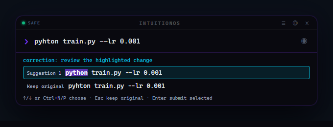

# Context-aware command correction — 2026-09-07

The milestone adds a shared, local command resolver to the terminal and Electron
HUD. It follows the existing core: cheap deterministic work first, learned
preferences from explicit evidence, then capability-gated execution with a
journal. The resolver neither calls Ollama nor grants execution permission.

## Starting point and implementation

The working branch was `phase-0-hygiene`, at the Phase 10 implementation. There
were no pre-existing working-tree changes and no applicable `AGENTS.md` was
present. The baseline **395 Python tests passed**. Existing capability, journal,
episode, predictor, retrieval, scheduler, terminal bootstrap, and WebSocket tests
were exercised. The baseline prediction evaluation remained 54.6% top-1 and
61.3% top-3, with 12/12 scripted tool-loop cases succeeding.

The earlier interfaces each used their own slash-command matcher and could
silently replace the command after submission. The terminal also rebuilt its
arguments by splitting and joining. The milestone replaces that path with:

- `core/command_resolver.py`: exact/incomplete/correction/ambiguous/unsupported
  results, adjacent-transposition spelling distance, extensible command providers,
  explicit Git grammar, project-aware acceptance ranking, and revision-bound
  correction sessions.
- `core/shell_environment.py`: discovery and execution tied to the same CMD,
  POSIX sh, or explicit PowerShell environment. PowerShell snapshots restore
  aliases/functions; metadata calls are qualified so a candidate function cannot
  hijack discovery by naming itself `Get-Command` or `ConvertTo-Json`.
- Shared terminal/HUD behavior: highlighted replacements, visible alternatives,
  keep original, and stale-selection invalidation. Voice produces an editable
  draft. Existing file commands, reminders, and HUD OS intentions keep their
  precedence over shell suggestions.
- The `run_command` capability: exact displayed command text, unchanged arguments,
  the existing irreversible-action gate, confirmation, and journal. Confirmations
  recheck current permissions, are connection-bound in the HUD, and cannot be
  reused after edits or a successful submission.
- Additive SQLite correction tables: token-only original/candidates/manual edit,
  explicit selection, hashed project context, and separate execution outcome.
  Acceptance can remain correct when execution fails. Silence is ambiguous
  evidence, not a rejection. Logging controls apply to both storage and ranking.
- `/forget` clears correction evidence and derived prediction state, invalidates
  displayed choices, and replaces live prediction workers. Shutdown saves the
  current model rather than restoring the forgotten one. Notes, tasks, and the
  audit journal remain separate.

Directly relevant fixes also include literal argument rendering in terminal
confirmation panels, preserving the argument suffix when legacy `/exec` chooses
the project Python, journal failures for nonzero exit codes, and previously
advertised HUD command handlers. The HUD `/reload` reports that model, database,
voice, and hardware changes need a restart.

## Final verification

| Check | Result |
|---|---|
| Full Python suite | **513 passed, 1 skipped**, 19.18 seconds |
| Renderer keyboard/state tests | **6 passed** |
| JavaScript syntax check | Passed |
| Existing prediction/tool-loop regression gate | Passed; **12/12** plans |
| New chronological correction regression gate | Passed |
| Generated capability manifest | Matches current registry; verified by full suite |
| Patch whitespace check | Passed |
| Electron showcase | Rendered and visually inspected; fixed response, no live backend |

The single skip is the actual POSIX `sh` argument round-trip test: `sh` is not
installed on this Windows machine. The one warning is an existing
Starlette/httpx TestClient deprecation. It does not fail the tests.

The new coverage includes exact commands and aliases, unavailable executables,
case and module namespaces, transpositions, ambiguous choices, Git subcommands,
unchanged quoted/whitespace-sensitive arguments, unsupported shell syntax,
manual feedback, chronological learning, disabled logging, forgetting, stale
edits, cross-client tokens, gate denial, cancellation, failed execution, and
shutdown after forgetting. Terminal tests drive real prompt_toolkit keyboard
input/rendering; HUD tests use real FastAPI WebSockets plus renderer event tests.
Actions with side effects use test stubs behind the real gate.

Actual local platform: **Windows build 26200, Python 3.10.11, Node 24.11.0**.
Harmless native argument round trips and alias/function discovery ran in **CMD,
Windows PowerShell 5.1, and PowerShell 7**. Full active-session PowerShell catalog
snapshots were checked in both PowerShell versions. POSIX case rules have unit
coverage, but Linux/macOS and Python 3.12 were not run locally. The repository's
Windows/Linux, Python 3.10/3.12 CI matrix now also runs the correction and renderer
checks; local results do not imply that remote jobs have passed.

## Measured correction results

All three matchers see the same 26 synthetic interactions in a declared command
catalog, including six repeated ambiguous `gco` interactions whose accepted
target is `gcp`. Each interaction is scored **before** its feedback is recorded.
There are also 14 valid-input preservation cases. These are a regression fixture,
not a user study or an estimate of real-world accuracy.

| Matcher | Top-1 | Top-3 | Incorrect changes to valid input | Warm median / p95 |
|---|---:|---:|---:|---:|
| Previous slash-only fuzzy matcher | 42.3% | 42.3% | 0 / 14 | 0.0410 / 0.0732 ms |
| New deterministic spelling baseline | 76.9% | 100.0% | 0 / 14 | 0.1132 / 0.7974 ms |
| Personalized ranking | **96.2%** | **100.0%** | **0 / 14** | 0.1367 / 0.8448 ms |

The old matcher offered one candidate, so its top-3 equals top-1. The
deterministic baseline includes the desired correction in all 26 top-three
lists, but consistently ranks `gcc` before `gcp` for the ambiguous fixture.
Personalization misses the first such interaction and learns from the explicit
selection for the next five. Those deliberately repeated cases explain the
measured improvement; they are not hidden held-out real users.

On this machine's actual installed CMD command catalog, warm resolution measured
**5.6825 ms median and 9.7390 ms p95** over 48 samples. Fixture timings use 240
samples per matcher. Timing excludes initial catalog discovery, UI rendering,
command execution, and model inference; scheduling and catalog size affect it.
Scores are ordering weights, not calibrated probabilities. Existing prediction
calibration keeps its original prediction target.

Raw outputs: [correction evaluation](results/2026-09-07-correction-evaluation.json),
[prediction evaluation](results/2026-09-07-prediction-evaluation.json), and
[showcase transcript](results/2026-09-07-showcase.txt).

## Showcase

```text
gti status
  correction: git status
pyhton train.py --lr 0.001
  correction: python train.py --lr 0.001
git statsu
  correction: git status | git stash
stat file.txt
  exact: Available command; input is preserved.
gco file.txt
  ambiguous: gcc file.txt | gcp file.txt
gti status | more
  unsupported: input unchanged; shell syntax cannot be safely corrected.
Stale selection after editing:
  BLOCKED: Correction is stale; display the current input again.
```



This is the actual Electron renderer supplied with a fixed resolver response.
The showcase blocks WebSocket connections and executes no displayed command.
The live transport and gate are covered separately by integration tests.

## Try it and reproduce the checks

From the project directory in PowerShell:

```powershell
# Terminal
.\.venv\Scripts\python.exe intuitionos.py

# HUD (starts a backend; do not duplicate a backend already on port 7432)
.\.venv\Scripts\python.exe start_ui.py
```

Type `/taks`, `gti status`, or `pyhton train.py --lr 0.001`. Review the highlighted
full command. Ctrl+N/P changes the selected alternative, Escape keeps the
original, and Enter submits the visible selection. A bare external command is
still denied while Safe Mode is on; after `/safe off`, it still needs a separate
action confirmation. Suggestion review works with Ollama unavailable.

For session aliases/functions, use `./scripts/start-intuition.ps1 -Interface
terminal` or `-Interface hud` from the PowerShell session to capture. PowerShell
must be discoverable on PATH. Only launch one backend on port 7432. Existing
processes must be restarted to load this implementation.

```powershell
.\.venv\Scripts\python.exe -m pytest -o addopts='' -q
node --test tests/hud_renderer_test.cjs
node --check ui/renderer/app.js
.\.venv\Scripts\python.exe -m eval.check
.\.venv\Scripts\python.exe -m eval.command_resolution --check
.\.venv\Scripts\python.exe -m eval.command_resolution --showcase
```

## Documentation and code-polish follow-up — 2026-09-07

The follow-up adds an [architecture and component guide](architecture.md),
[resolver API/protocol reference](command-resolution.md), and
[contributor guide](development.md), linked from the README. Module and public
API docstrings explain ownership, inputs, return values and lifecycle rules.
Formatting expands dense control flow; comments explain argument preservation,
review/approval tokens, shell metadata, locking and forgetting. Unused imports
were removed. Core ranking, shell discovery, wire fields and policy are unchanged.

Tracing startup uncovered a reminder bug: both interfaces installed memory
before creating the scheduler, but only the reverse binding order connected
them. `set_scheduler` now attaches the already-installed memory. Two new tests
first reproduced the missing-memory failure and then passed: one through the
terminal bootstrap, the other through the HUD's real WebSocket reminder path.

| Follow-up check | Result |
|---|---|
| Full Python suite | **515 passed, 1 skipped**, 19.25 seconds |
| Renderer keyboard/state tests | **6 passed** |
| Prediction and tool-loop gate | Passed; **12/12** plans |
| Chronological correction gate | Passed; **96.2% top-1**, **100% top-3**, **0/14** valid inputs changed |
| Documentation links | All **61** local links in the README and three new guides resolved |
| Source checks | Python formatting/import/name checks, both JavaScript syntax checks, and patch whitespace passed |

The skip and existing TestClient deprecation warning are unchanged. These are
local Windows results; no remote CI outcome is claimed. The earlier raw metrics
and showcase above remain the original milestone evidence. The code polish does
not change the displayed UI, so its reviewed screenshot remains representative.

## Remaining limits

- The parser deliberately does not repair shell expressions, filenames, flags,
  values, quoted executable names, or arbitrary arguments. Git correction
  handles the immediate subcommand; it does not parse global Git options to find
  a later subcommand. If installed Git metadata cannot be read, subcommand
  correction is disabled instead of guessing which unknown names are valid.
- Catalogs are cached: PATH scanning refreshes after a short TTL and Git metadata
  after 30 seconds. PowerShell snapshots capture startup state. Restart after
  changing session definitions; functions requiring captured variables, closures,
  or module state may need adaptation. Discovery does not prove a command will
  succeed.
- Windows PowerShell 5.1's native argument binder drops empty native arguments;
  the test explicitly records that shell behavior. The resolver preserves the
  original command text and does not claim to change PowerShell semantics.
- Context learning currently uses accepted token corrections, recency, frequency,
  and a project key. It does not infer intent from arbitrary argument contents or
  continuously learn from silence. Unknown free text can still reach the existing
  local LLM; unsupported shell expressions get an explanation.
- The capability layer is not OS isolation. The command journal can contain
  actual execution arguments for audit/undo, even though correction learning and
  episode/context representations exclude them.
