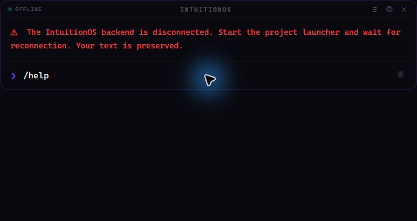
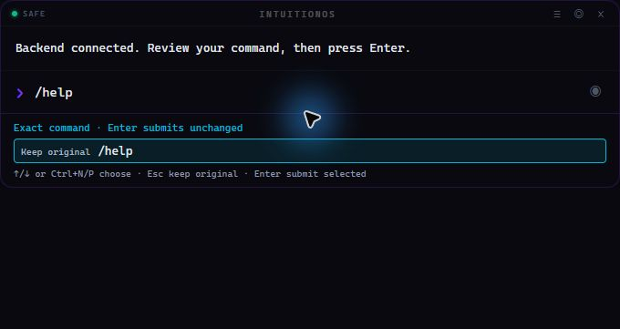
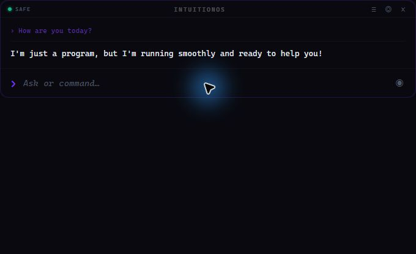

# HUD input, microphone and launcher recovery — 2026-09-07

The reported failure was reproduced against the running environment: Electron
was open, but no Python backend was listening on `127.0.0.1:7432`. The original
renderer silently dropped Enter and microphone requests when disconnected. A
placeholder said "Reconnecting", but existing input hid that explanation.

## Changes

- The HUD shows a persistent **OFFLINE** status and an explanation when its
  backend is unavailable. Enter keeps the unsent draft. After reconnection the
  exact draft is resolved again for review; commands and approvals are never
  replayed automatically.
- Model requests immediately display the submitted text and **Thinking…**.
  Streaming output and the final reply replace that pending state. Previous
  output no longer looks like the current request was ignored.
- Voice startup reports loading, readiness and setup errors. Recording/device
  failures and transcription exceptions reach the HUD and clear busy indicators.
  A wall-clock limit and manual stop also work when a device supplies no audio
  callbacks. Capture and transcription cannot overlap on the shared recognizer.
  First-run Whisper model downloads remain supported.
- `start_ui.py` waits for `/health`, launches the native Electron executable on
  Windows, and supervises both processes. An occupied port gets an actionable
  error. The Electron child does not inherit `ELECTRON_RUN_AS_NODE`.
- Windows cleanup stops the launcher's owned process tree before reaping its
  parent. This matters because the virtual-environment Python executable can
  spawn a second Python process; terminating only the redirector can leave the
  real backend holding port 7432.

The implementation remains in the existing components: connection presentation
in the renderer, voice lifecycle in the recognizer/backend, and process ownership
in the launcher. Command correction and execution permissions remain separate.

## Hands-on verification

These checks used the **actual Electron window and live local backend**, with
native mouse/keyboard input. The screenshots below are live observations.

| Check | Observed result |
|---|---|
| Connected typing and Enter | Typed `/help`; Enter displayed the command list |
| Real disconnection | Stopped only the temporary test backend; HUD showed OFFLINE and retained `/help` after Enter |
| Real reconnection | Restarted the backend; the draft reappeared as an exact reviewed command, without automatic submission |
| Enter after recovery | `/help` displayed the command list again |
| Local model response | `How are you today?` received `I'm just a program, but I'm running smoothly and ready to help you!` from the configured local model |
| Microphone start/stop | Recording opened, displayed Listening, stopped, reported no speech and returned to idle |
| Complete launcher | Started `start_ui.py`, observed healthy backend and connected HUD |
| Complete shutdown | Ctrl+Q produced `IntuitionOS stopped.` and **zero listeners on port 7432**; no owned Python/Electron test processes remained |

The model response was observed, but this manual check did not measure chat
latency. On this machine `hello` also resolves as an available shell command;
Safe Mode correctly refused its execution. A full natural-language question was
used to exercise chat.

The Windows default input was **Steam Streaming Microphone**. Physical microphone
devices were also enumerated, but the default was not changed. The live test
verified capture/stop/error recovery, **not successful recognition of spoken
words**. Select the intended device under Windows Settings → System → Sound →
Input when the default virtual microphone does not receive your speech. Voice
transcription still fills an editable draft and never submits it automatically.







Additional evidence: [live help response](results/2026-09-07-hud-live-help.png)
and [microphone back at idle](results/2026-09-07-hud-mic-idle.png).

## Automated verification

| Check | Result |
|---|---|
| Full Python suite | **552 passed, 1 skipped**, 22.08 seconds |
| Launcher regressions | **21 passed**, included in the Python total |
| Voice regressions | **16 passed**, included in the Python total |
| Renderer regressions | **17 passed** |
| JavaScript syntax and Python import/name checks | Passed |
| Patch whitespace and documentation links | Passed |

The skipped test requires POSIX `sh`, unavailable on this Windows machine. The
existing Starlette/httpx TestClient deprecation warning remains. Automated voice
tests stub audio devices and model loading: they cover failure propagation,
cleanup, disabled/loading states, model preparation failure, silence and
transcript delivery without recording audio or downloading models. Launcher
tests stub processes and network checks; the live lifecycle check above supplies
the separate Windows process evidence. No remote CI result is claimed.

```powershell
.\.venv\Scripts\python.exe -m pytest -o addopts='' -q
node --test tests/hud_renderer_test.cjs
node --check ui/renderer/app.js
git diff --check
```

## Run the fixed app

```powershell
cd C:\Users\Soheil\Documents\GitHub\IntuitionOS
.\.venv\Scripts\python.exe start_ui.py
```

Keep the launcher running. Alt+Space shows/hides the HUD; Ctrl+Q quits both the
HUD and its backend. `npm start` inside `ui` opens only the overlay and requires
an already-running backend. See the [setup and troubleshooting guide](../README.md)
and [component architecture](architecture.md) for details.
