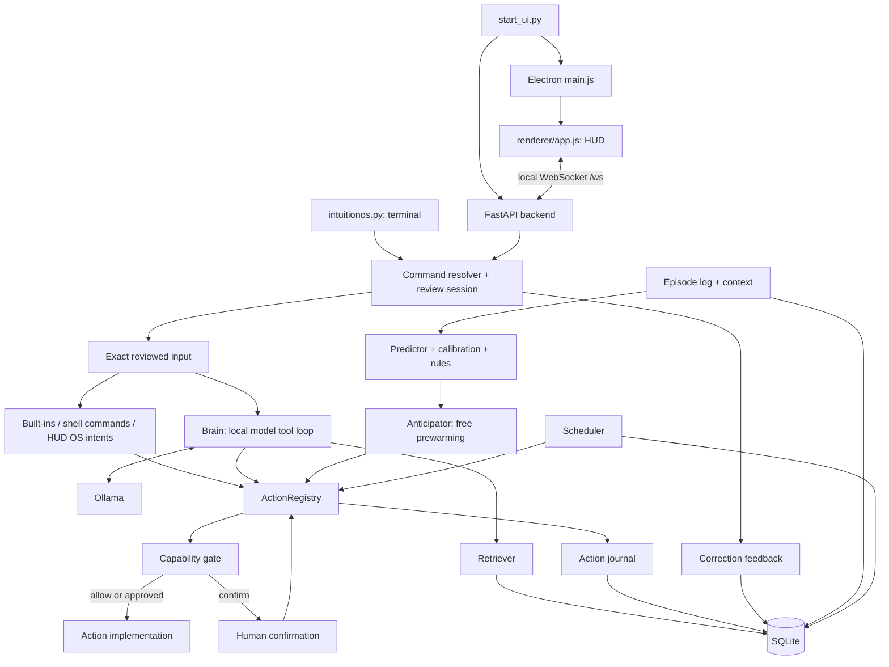

# How IntuitionOS works

IntuitionOS is a local assistant with two interfaces: an Electron desktop HUD and
a Python terminal. Both use the same core for command resolution, memory,
prediction, and gated actions. The interfaces own presentation and lifecycle;
the core owns the interpretation, learning, and execution rules.

Three questions drive the implementation:

1. **What did the user mean to type?** The command resolver offers deterministic
   spelling corrections and learns from explicitly accepted choices.
2. **What might the user do next?** The predictor uses recorded experience;
   the anticipator prepares inexpensive results before submission.
3. **May the requested action run?** The capability gate validates arguments,
   scope, actor, and permission independently of either suggestion system.

Correction scores rank spellings. Prediction confidence estimates a future
action. Neither is a substitute for an execution permission.

## Process and component map

The terminal is a complete Python process; it does not connect to the HUD
backend. Running both creates separate runtime objects, even if their configured
SQLite path is the same. Safe Mode and pending approvals are process-local.
The HUD backend binds to `127.0.0.1:7432`; only one backend can bind that address.
Each process also starts a scheduler. Run one interface at a time against a
shared database to avoid duplicate reminder delivery: due tasks are not claimed
atomically across processes.

| Component | Source | Responsibility |
|---|---|---|
| HUD launcher | [start_ui.py](../start_ui.py) | Wait for backend health, launch native Electron, supervise and clean up owned child processes |
| Terminal entry | [intuitionos.py](../intuitionos.py), [terminal.py](../interface/terminal.py) | Bootstrap collaborators, display reviewed commands, handle built-ins and confirmations |
| Backend | [server.py](../interface/server.py) | FastAPI lifespan, WebSocket routing, per-client selections/approvals, streamed replies |
| Desktop window | [main.js](../ui/main.js) | Window placement, visibility, resize IPC, global shortcuts |
| HUD renderer | [app.js](../ui/renderer/app.js), [index.html](../ui/renderer/index.html), [style.css](../ui/renderer/style.css) | Input draft, highlighted alternatives, confirmation bar, panels, offline/reconnect and voice feedback |
| Command resolution | [command_resolver.py](../core/command_resolver.py) | Available-command providers, safe replacement spans, spelling/context ranking, explicit feedback |
| Execution environment | [shell_environment.py](../core/shell_environment.py) | Match shell discovery to execution; read PowerShell snapshots without invoking candidates |
| OS intent grammar | [os_intents.py](../core/os_intents.py) | Reserve existing app phrases and map HUD natural-language Windows requests |
| Context | [context.py](../core/context.py) | Working directory, cached Git state, recent activity, timing cues |
| Experience | [episodes.py](../core/episodes.py) | Submitted action representations, displayed prediction observations, outcomes, forgetting |
| Prediction | [predictor.py](../core/predictor.py) | Frequency/recency model, contextual scorer, cold-start heuristics, persisted model state |
| Calibration | [calibration.py](../core/calibration.py) | Compare prediction confidence to observed hint acceptance; load cost thresholds |
| Consolidation | [consolidation.py](../core/consolidation.py) | `/dream` extracts recurring patterns into inspectable rules; retire unreliable rules |
| Anticipation | [anticipator.py](../core/anticipator.py) | Debounced background prediction, bounded TTL cache, inexpensive prewarming |
| Model loop | [brain.py](../core/brain.py) | Retrieve context, parse proposed tool calls, dispatch, observe results, suspend/resume confirmation |
| Model transport | [llm.py](../core/llm.py) | Ollama chat/streaming, request timeouts, typed connection/model errors |
| Capability policy | [capabilities.py](../core/capabilities.py) | Schemas, actors, path scopes, reversibility, gate decisions, pending action tokens |
| Actions | [actions.py](../core/actions.py) | The shared dispatch path plus file, task, shell and hardware implementations |
| Audit and undo | [journal.py](../core/journal.py) | Record attempted non-free actions, results, captured reversal data, undo status |
| SQLite access | [memory.py](../core/memory.py) | Locked connection helpers and base note/message/task tables |
| Retrieval | [retrieval.py](../core/retrieval.py) | FTS5/BM25 search, recency/context cues, prompt-budget limits |
| Reminders | [scheduler.py](../core/scheduler.py) | Timezone-aware due times, polling, notifications, repeats, gated payloads |
| Voice | [voice.py](../core/voice.py) | Microphone recording, silence detection, local Whisper transcription into an editable HUD draft |
| Windows operations | [os_sandbox.py](../core/os_sandbox.py) | Platform-specific app, clipboard, volume, screen, process and input operations |
| Hardware adapters | [plugins/](../plugins) | Driver schemas and CPU/GPU/LED implementations; LED control is simulated by default |
| Verification | [tests/](../tests), [eval/](../eval) | Behavioral regression tests, synthetic chronological evaluations, showcase output |

## HUD startup and recovery

`start_ui.py` owns one backend/Electron pair. It checks for an existing listener,
starts the backend with its own Python interpreter, and waits for a valid
`/health` response before opening the HUD. Startup failure and timeout are
reported in the launcher terminal. On Windows it launches the native Electron
binary, avoiding a CMD shim whose lifetime may differ from the window's.
The launcher must remain running to supervise its children. Normal quit or an
unexpected child exit triggers cleanup; Windows cleanup targets the owned PID
trees so a venv redirector cannot leave its backend child behind. An unrelated
process already using the port is diagnosed, not adopted or stopped.

An independently launched renderer can outlive its backend. It displays
`OFFLINE`, preserves the current draft, and clears stale correction, approval,
and recording states when the socket closes. A failed send does not clear an
unsent command. On reconnect it advances its draft revision and requests a new
resolution of the current text. Commands and approvals are never replayed; the
user must submit a freshly displayed selection. This is distinct from the
launcher, which closes its own HUD if its backend exits unexpectedly.

## Follow one command

For `gti status`, the UI first asks the shared resolver for a result. It finds
available command names, ranks plausible spellings, and constructs `git status`
by replacing only the command's original string span. Argument characters are
copied unchanged. It returns suggestions; it does not execute `git status` or
any candidate command. Discovery can run fixed Git metadata queries.

The interface displays the full candidate and highlights `git`. A
`CorrectionSession` binds that display to the original input, a revision, and a
one-use selection token. Enter commits the visible choice. Editing either the
command or its arguments invalidates the earlier display.

Recognized external commands reach `actions.dispatch("run_command", ...)`.
The gate sees an irreversible action: Safe Mode must be off and an action
confirmation is still required. This is a **second token**, distinct from the
correction-selection token. On approval, the registry consumes the stored action
arguments, rechecks policy, records the attempt, and calls the selected shell.
The shell result becomes an execution outcome; correction acceptance was already
recorded independently. A failed Git command can still be a correctly accepted
spelling correction.

See the [command-resolution reference](command-resolution.md) for data contracts,
an executable provider example, and the concrete WebSocket exchange.

## Other paths through the core

**Built-ins and Windows intentions.** `/read`, `/tasks`, and other app commands
are handled by the interface. Actionful operations use the registry rather than
calling an implementation directly. Existing `ls`, `tree`, reminder phrases and
Windows intentions are recognized before shell suggestions can replace them.
The HUD registers OS capabilities and maps supported phrases directly; the
terminal does not implement that direct phrase-to-OS dispatch path. Use
`/capabilities` to inspect the live registry for the process you are running.

**Model-assisted requests.** Other free text reaches `Brain.step`. It combines
the system prompt, recent conversation, bounded retrieved notes, and context.
The local model proposes a tool or returns a reply. Tool arguments pass the same
gate as typed actions. A confirmation suspends the loop; `Brain.resume` consumes
the reply and continues with the observation. Iteration and time limits are
checked between iterations; a blocking model or tool call can exceed the loop's
time budget. Malformed tool output receives at most a structured retry before
the system falls back to a readable reply.

**Anticipation.** Buffer changes wake a debounced worker. It asks the predictor
for likely next actions and can prewarm a small set of cheap reads. It dispatches
as `actor="anticipator"`, which the gate restricts to free capabilities. A
separate reveal threshold controls visible prediction hints. This is independent
of the correction list: predicting a next action and correcting a misspelled
command are different observations.

**Reminders.** Both bootstraps install a scheduler and the same `Memory` instance
used by actions. The binding helpers support either initialization order.
Natural-language time is interpreted in the configured timezone and stored as
a UTC epoch. A worker polls due tasks, notifies the interface, and marks one-off
reminders `fired`; the user marks them done. Repeating reminders advance from the
previous due time. Stored action payloads dispatch as `actor="scheduler"`;
irreversible payloads are denied and actions requiring confirmation are not run
unattended. The app must be running to deliver reminders.

**Voice.** The backend owns one `VoiceRecognizer`; recording uses the Windows
default input device through `sounddevice`. A worker captures audio, detects
silence, and transcribes it locally with Whisper. Initial model preparation may
download weights and happens independently of Ollama. A model-loading lock
prevents concurrent setup. Microphone and transcription errors reach the HUD
instead of leaving its recording/transcribing indicator active indefinitely.

The initial `status` message includes `voice: {state, available, text}`.
Subsequent transitions use `voice_status`, with states such as `loading`,
`ready`, `recording`, `transcribing`, `disabled`, and `error`. Voice errors carry
`source: "voice"`; recoverable capture failures leave retry available. The
backend tracks the recording's owning socket and stops capture if that socket
disconnects. A completed transcript is delivered as `voice_text`, which fills
the editable input and starts command review without automatic submission.

## State ownership and persistence

The HUD backend keeps its shared collaborators in `_state`. Each socket has its
own prediction window, correction session and input revision. Pending HUD action
approvals also identify their owning socket. The renderer's selection is a view;
the server validates the committed text and token.

The terminal owns those collaborators in its main loop. `CorrectionPrompt`
connects real prompt_toolkit rendering to the same core review session. An Enter
arriving before a changed draft has been redrawn requests a redraw instead of
accepting an unseen candidate.

`Memory` serializes access with a reentrant lock. Feature stores add tables via
its helpers rather than opening independent write paths. New schemas should be
additive so existing notes and reminders survive upgrades.

| Store | Contents | Effect of `/forget` |
|---|---|---|
| `mem` | Explicit notes, conversations, some tool/reminder messages | Preserved |
| `mem_fts` | Search index maintained from `mem` by triggers | Preserved with source messages |
| `tasks` | Reminder title, UTC due timestamp, status, payload | Preserved |
| `episodes` | Prepared action/context, prediction observation, execution outcome | Deleted |
| `predictor_state` | Serialized frequency/context predictor | Deleted and live predictor replaced |
| `calibration_state` | Fitted prediction calibration | Deleted |
| `rules` | Consolidated habits | Deleted |
| `command_corrections` | Original/candidate/selected tokens, manual edit, project key, outcome | Deleted |
| `command_correction_meta` | Correction invalidation generation | Retained and incremented |
| `journal` | Action arguments, decision/result and undo payload | Preserved |

Interfaces use `learning_text` to keep argument values out of episode/context
command strings. The underlying storage helpers accept prepared data and do not
redact arbitrary callers' input. Explicit notes, model conversations, diagnostic
logs, and the action journal have separate retention purposes. In particular,
the audit journal needs actual arguments and captured file contents for undo.

Forgetting is more than deleting rows: live correction sessions, prediction
workers and caches must be invalidated or replaced. Shutdown must save the
current predictor, not an object captured before `/forget` or `/reload`.

## Execution and configuration boundaries

Each shell command runs in a fresh child process. CMD is the Windows default;
POSIX uses `sh`. PowerShell is explicit and uses a `-NoProfile` environment plus
an optional startup snapshot. Discovery and execution must use the same shell
and catalog. The [PowerShell launcher](../scripts/start-intuition.ps1) captures
active alias/function definitions, not closures or arbitrary session state.

The path jail constrains declared path arguments; it is not OS isolation for a
shell process. Reversibility is an action classification, not a promise that
every reversible action has automatic undo. Only capabilities with successful
undo capture provide `/undo` data.

[config/config.yaml](../config/config.yaml) selects the model, database, timing,
thresholds, voice and hardware options. `OLLAMA_HOST` defaults to a loopback
endpoint; `INTUITION_SAFE` supplies the initial process-local Safe Mode.
`INTUITION_SHELL` and `INTUITION_SHELL_CATALOG` select the command environment.
Keep loopback endpoints for local operation. The HUD can operate without
Ollama for built-ins and command review; model-assisted requests need it, and
voice uses its separate Whisper model. Model installation/downloads are setup
work, not command-correction inference.

Continue with the [contributor guide](development.md) for changes and checks, or
the [measured milestone report](2026-09-07-command-resolution.md) for test results.
The [HUD recovery report](2026-09-07-hud-recovery.md) records the launcher,
connection, and microphone investigation with live verification.
